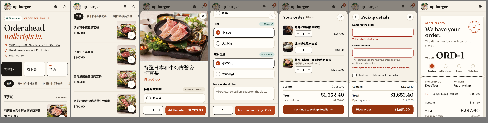
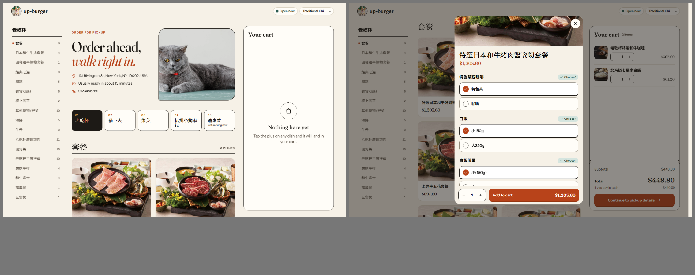
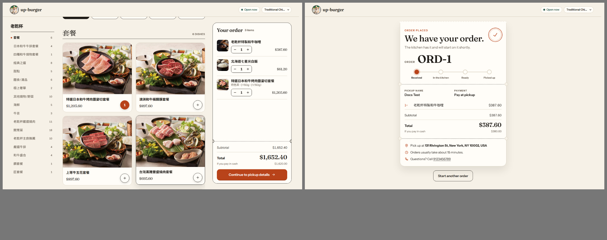
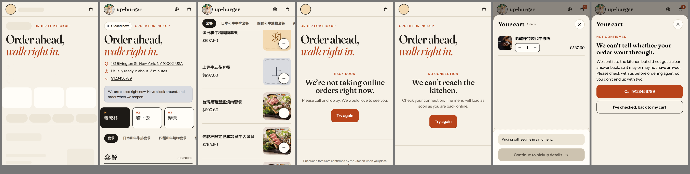
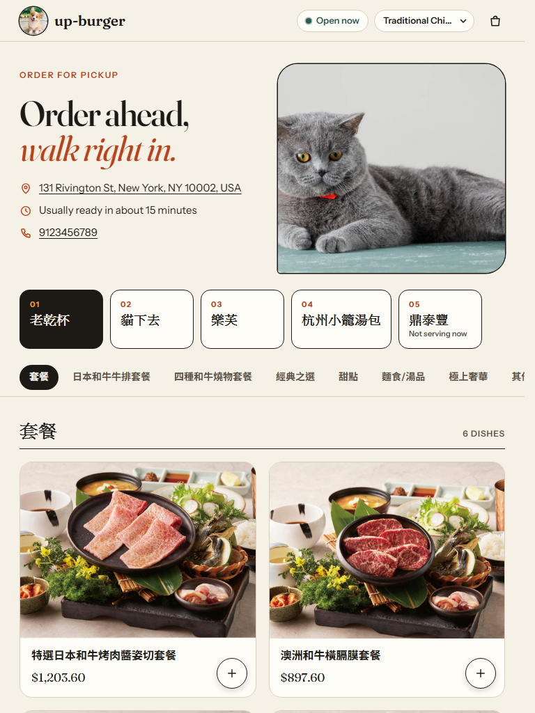
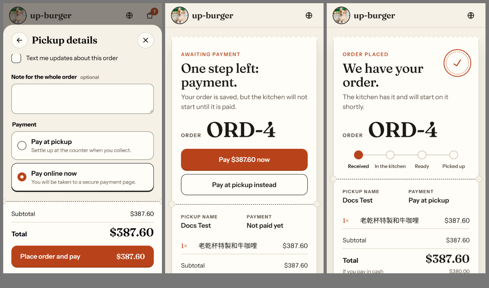
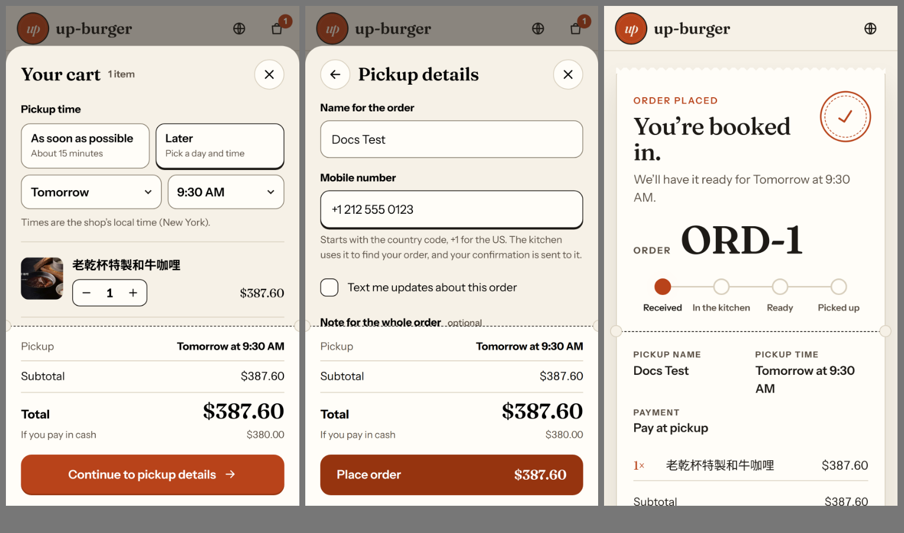

# partner-storefront-demo

A static, frontend-only ordering site built on the uLite Online Order Partner API, using nothing but its public documentation.

- Live: https://formosaup.github.io/partner-storefront-demo/
- API docs used: https://api-dev.ulite.com/online-order/partner/docs (OpenAPI file, version v1)
- Stack: Next.js 16 static export, React 19, plain CSS. No backend, no keys, no secrets.









## What works end to end

Verified on the deployed page, against the real development store:

1. Store information and opening status (`GET Store/Settings`), language list (`GET Store/Languages`).
2. Menus, categories and products (`GET Menu`, `GET Menu/{menuId}`), with the menu language switchable through `X-Context-Language`.
3. Modifier groups with required and optional rules (`GET Product/Modifiers`).
4. Cart, re-priced by `POST Order/Preview` after every change. Totals, discounts, fees and blocks are read from the quote.
5. Pickup details, then a fresh quote immediately before `POST Order`, as the docs require.
6. Order status page (`GET Order/{orderId}`), polling every 20 seconds while the order is open and the tab is visible, and retrying with back-off after errors.
7. Payment options taken from the store settings. The store offered `PAY_IN_STORE` only at first and added `PAY_ONLINE` during the work; both are supported.
8. Online payment up to the hosted payment page: `POST Order`, `POST Transaction/Initial`, top-level navigation to the payment link, Back to the order page, and switching the unpaid order to pay at pickup with `PATCH Order/{orderId}`.
9. Scheduled pickup: as soon as possible or a later time, offered from `schedulableWindows` in half-hour steps and sent as `scheduledTime`. Menus are re-read for the chosen time, a time that has passed is replaced, and the order page shows the pickup time from `estimateTime`.

Real orders placed: **3**.

- `ORD-1`: one item, pay at pickup.
- `ORD-4`: one item, pay online. Stopped at the payment page (no card was entered), then switched to pay at pickup.
- `ORD-1` of the following day (the serial restarts daily): one item, scheduled for the next morning at 9:30, pay at pickup. Read back with `lifecycleStatus: SCHEDULED` and `estimateTime` equal to the chosen time.

Both used SMS updates off and the phone number `+1 212 555 0123` from the reserved fictional range.

Other calls made outside normal page use: read-only probes of the catalogue and modifiers, and seven quotes sent by script to learn response shapes (how a phone number and a scheduled time are read).

## What is not working or was left out

| Item | Why |
| --- | --- |
| Completing a card payment | No test card is documented, so no payment was completed. The success return, the "confirming your payment" state and a failed-payment retry are implemented from the documentation but **not exercised**. |
| Weekly opening hours | The `openHours` format is not documented (see gaps). Only open, closed or paused is shown. |
| Tips | `TipInfo` is undocumented, and the docs place tips on the online payment call only. |
| Receipt | `GET Order/{orderId}/Receipt` does not say what format it returns. |
| Open-price products and options | The quote request has no field to carry a price, so these show "order in store". None exist in this store. |
| Delivery, accounts, loyalty, cancellation | Out of scope per the documentation. |
| A real `429` | Not provoked on purpose. The rate-limit state was verified with a mocked response only. |
| Interface language | Menu content follows the chosen store language; the interface text itself is English only. |
| Banner on phones | Shown from tablet width up only. The store's original banner was 5760px wide and did not decode on a test phone; phones go straight to the menu. |

## Design decisions

**Starting point.** The store's original assets were a corgi logo, a banner of a grey cat on a celadon table, five menus from different kitchens, and photography that ranges from 2,000px studio shots to 150px thumbnails with price stickers. The design had to give that mix one voice.

- **Palette.** Sampled from the store's own images: corgi amber and a deeper persimmon for actions, celadon and slate from the banner, on warm paper with brown-black ink. Paper rather than white, so photos with white backgrounds still read as framed. Text pairs meet WCAG AA and form-control borders meet 3:1.
- **Type.** Fraunces (display, prices, numbers) with Instrument Sans (interface). Chinese, Japanese and Arabic content falls back to the system's native faces instead of shipping megabytes of web font. The hero headline uses the high-contrast display cut of Fraunces, subset to its own letters (6KB) and inlined, so it paints in its final face with the first frame.
- **Visual language.** A counter ticket: numbered menus, dashed perforations with punched notches, a cart that looks like a ticket stub, and an order confirmation that prints out of the top of the page and gets stamped.
- **Layout.** Phone first: one column, the photo and add button under the right thumb, a sticky section bar, and a bottom bar for the cart. Tablet: two-column hero with the banner, card grid, cart as a side drawer. Desktop: three working columns (section rail, menu, a persistent ticket), not a stretched phone.
- **Photography.** Photos are the largest thing on every card. A dish with no photo, or a broken one, gets a tinted tile carrying its first character. In the dish dialog, a low-resolution photo is shown as a small framed print instead of being stretched.
- **Motion.** Each animation reports something: a photo flies into the cart and the cart bumps (from the dish dialog the cart just bumps); the plus button turns into the quantity; option checkmarks draw themselves and the "Required" pill turns into a tick; a missed required group shakes; the ticket prints and is stamped. Skeletons reserve the space of the content they stand in for (measured layout shift 0.003). `prefers-reduced-motion` removes the motion.
- **Store assets.** Late in the work the store's logo and banner were replaced, through the store's own back office, with files made for this design: a persimmon "up" roundel (`brand/logo.png`) and a 1600 by 900 collage of the store's own dish photos (`brand/banner.jpg`, 238KB). `tools/brand.mjs` regenerates them. The palette keeps its origin in the first assets.
- **Wordmark.** The API returns no store name, so the wordmark is the `subdomain` value exactly as returned (`up-burger`).
- **Accessibility.** Native `<dialog>` for focus trapping and Escape, real radio and checkbox inputs for options, labelled fields with inline errors, a skip link, visible focus rings, status announcements for cart changes, cart totals and order progress, and `lang` on store content.

**Performance** (Lighthouse 12.8.2 against the deployed page, visible Chrome window):

| | Performance | Accessibility | Best practices | LCP | CLS |
| --- | --- | --- | --- | --- | --- |
| Mobile, three runs | 95, 96, 99 | 100 | 100 | 2.1 to 2.7 s | 0.003 |
| Desktop, one run | 82 | 100 | 100 | 3.1 s | 0.002 |

- The desktop score was measured with the store's original banner (1.3MB, 5760px). After the store's logo and banner were replaced with lighter files (see below), desktop measured 80 with LCP 2.5 s; what holds it down now is the full-size dish photos, three columns of them.
- Headless Chrome on the test machine scored 79 to 95 on mobile because it showed a blank first frame for about 2.5 seconds. Real Chrome paints at 0.3 to 0.65 seconds. This looks like a headless artifact but is not explained.
- Interaction, measured with 4x CPU throttling: switching to a menu already seen shows its dishes in the next frame (25 to 41 ms); a menu not seen before takes one request (about 130 to 170 ms); adding to the cart shows the count in about 100 ms.

What was done for speed: photos are requested only when about to scroll into view (the API offers one full-size file per image); menu sections mount in idle slices and skip rendering while off screen; dish cards are memoised so a cart or scroll update touches only what changed; menus are cached in memory and warmed when a tab is hovered or focused; the headline font subset is inlined.

## Documentation gaps

Everything below is a place where the documentation was missing, ambiguous or wrong, or where I had to make a choice it did not cover. The list describes the documentation as first read on 2026-10-01. The provider has revised it since (error codes, rate limits, timestamps, the payment response, and scheduling), so several items are now addressed at the source.

### Wrong or contradictory

1. **Payment options field.** The guide says to read `channelSetting.paymentOptions`. The response has no `channelSetting`; the field is `onlinePaymentOptions` at the top level.
2. **Error code field.** The guide says `error.code` is a stable machine-readable code such as `PREVIEW_ORDER_NOT_FOUND`. The schema types `error.code` as an integer (200 to 712) and has a separate string `resultCode`; every example shows `"code": 400, "resultCode": "BAD_REQUEST"`. The site reads both. I never saw a real error body.
3. **Response schemas ignore the envelope.** The guide says every response is wrapped in `{ isSuccess, data, message, error }`, and it is. Most 200 schemas reference the bare payload instead. `ApiResponseOfT` refers to an empty schema `T`, and several 403/404/500 responses reference the success payload.
4. **`PaymentInitial.PaymentInitialResponse` is self-referential.** `paymentLinkUrl` and `transactionId` exist only in prose.
5. **`PATCH Order/{orderId}`.** It is "only allowed while the order has no transaction attached, including failed ones", and is also described as how "a failed online payment becomes pay at the store". Both cannot hold.
6. **Loyalty.** Declared out of scope, yet `agreeToJoinLoyalty`, `loyaltyRedemptions` and `estimatedPoints` appear in the request and response schemas.
7. **`Transaction/Initial` body description** mentions manual card entry and `entryMode`, while the prose says only `orderId` and `paymentMethod` are needed.

### Missing

8. **Store name.** `Store/Settings` has no display name. Only `subdomain` is available. The store does have one (the back office shows "up burger"); the partner API just does not return it.
9. **Currency.** No currency code anywhere. The address is in New York while prices look like New Taiwan dollars. The site shows a bare `$`.
10. **Cash price and card price.** Nothing explains `cashPrice` / `cardPrice`, `defaultPriceType`, `adjustPercentage`, or what `priceType` to send to `POST Order`. I show the default type, send `defaultPriceType`, and show the other total as "if you pay in cash".
11. **Opening hours.** `openHours` has no description: weekday keys, time format, time zone, and what `00:00:00` to `00:00:00` means (the store returns it for five days).
12. **Open or closed.** No documented way to tell whether the store is open now. I derive it from `asapAvailable`, `storePaused`, `isOnlinePaused` and `orderTypeOptions`, none of which has a description.
13. **Scheduling.** `schedulableWindows` and `scheduledTime` were date-times without an offset and with no stated time zone, and how to ask for "as soon as possible" was not stated. Scheduling was first left out for that reason, then built once the behaviour was confirmed: both are the store's local time, the windows already include preparation time, omitting `scheduledTime` means as soon as possible, and the order's `estimateTime` carries the chosen time. One trap remains worth a warning in the docs: a correctly formed RFC 3339 value with an offset (`2026-10-03T10:00:00-04:00`) is converted to UTC and then treated as local time, so it lands four hours off and is reported as `OUTSIDE_OPEN_HOURS`. Only the offset-less form works.
14. **Order type.** "Pickup and takeout only", but the enum has `PICK_UP` and `TO_GO` and no guidance. I send `PICK_UP` because the settings list it.
15. **Which catalogue endpoint.** Three endpoints return the catalogue in three shapes. Only `Menu/{menuId}` returns the `storeMenuCategoryId` that a quote needs, and only it returns tags. `Category/AllWithProducts` returns all menus flattened, with duplicate category names. `Product/Full` has no images.
16. **Modifier selection.** The quote accepts both `itemIds` and `items[{ itemId, quantity }]` with no guidance. The option's id is called `modifierId` in `Product/Modifiers` but `itemId` in the quote. `allowMultiSelection`, `maxQuantity` and `isModifierSufficient` are undocumented. I send `items` with quantity 1; the quote echoed the selection back correctly.
17. **Open-price items.** `isOpenPrice` and `openPriceModifiers` exist, but the quote request has no price field.
18. **Availability.** How `status`, `availabilityStatus`, `stock` and `isAvailableNow` (on menus and categories) relate is not stated. I treat `availabilityStatus` as sold out and `isAvailableNow: false` as not orderable now.
19. **Phone number.** No format for `pickupPhone` and no country code field in the request, though responses carry `pickupCountryCode`. In practice both `2125550123` and `+12125550123` are accepted and stored as country code `1` plus the national number. The site sends the international form and defaults the field to `+1`.
20. **SMS consent.** `agreeToSmsUpdates` is undocumented. The guide says the phone "receives the confirmation message" without saying whether that depends on this flag.
21. **Order status.** Five status fields (`orderStatus`, `orderStatusDisplay`, `orderStatusLabel`, `lifecycleStatus`, `fulfillmentStatus`) with no guidance on which a customer page should follow, the transitions, or how often to poll. I follow `fulfillmentStatus` and `orderStatusLabel`.
22. **Timestamps.** `createDatetime`, `estimateTime` and others are `int64` with no unit. They are epoch milliseconds in practice. The site does not display them.
23. **Ordering error codes.** "Documented on the operation that returns them", but only `PREVIEW_ORDER_NOT_FOUND` and `INVALID_PAYMENT_OPTION_UPDATE` are named. Nothing covers sold out, below minimum, or invalid modifiers. The 200-plus integer `ResultCode` values are unnamed.
24. **Rate limits.** No numbers. `429` is declared on one operation only, with no body. Most importantly for a browser client, it is not stated whether `Retry-After` is exposed through `Access-Control-Expose-Headers`; if it is not, a browser cannot read it. The site falls back to its own back-off in that case.
25. **Tips.** `tip.isEnabled` is true, `EstimateTip` and `TipInfo` exist, but no field is described, and nothing says how tips work for pay in store.
26. **Receipt.** Declared as `application/json` containing a binary string.
27. **Images.** No sizes, formats or resizing parameters. The banner is 5760 by 3298 (1.3MB); product photos range from 153px to 2242px wide.
28. **Query parameters.** `scheduledTime` and `name` on the menu endpoints had no description. `scheduledTime` turns out to re-judge `isAvailableNow` for that time; `name` is still unexplained and unused here.
29. **Development server.** The docs list production and staging only.
30. **`Transaction/Initial` response.** The guide says it "carries a `transactionId`" to keep for `Transaction/Status`. The real response is `{ code, paymentLinkUrl }` with no `transactionId`, so `Transaction/Status` cannot be called from what this endpoint returns. The site reads payment attempts from `transaction[]` on `GET Order/{orderId}` instead.
31. **When `PATCH` is allowed.** After `Transaction/Initial` had issued a payment link and the customer backed out, `PATCH` to `PAY_IN_STORE` succeeded. Whether an issued link counts as "a transaction attached" is not stated (see also item 5).
32. **Test payments.** No test card numbers or sandbox instructions for the hosted payment page.
33. **Settings change without notice.** `onlinePaymentOptions` changed while a page was open. Nothing says how fresh settings must be; the site refreshes them when the visitor returns to the tab after two minutes.
34. **Language header.** Its description refers to internal storage ("from Language.Code in database") and hardcodes seven codes, while the guide says to use `Store/Languages`.

### Places where I had to choose

- The wordmark is the `subdomain` value (gap 8) and amounts use `# partner-storefront-demo

A static, frontend-only ordering site built on the uLite Online Order Partner API, using nothing but its public documentation.

- Live: https://formosaup.github.io/partner-storefront-demo/
- API docs used: https://api-dev.ulite.com/online-order/partner/docs (OpenAPI file, version v1)
- Stack: Next.js 16 static export, React 19, plain CSS. No backend, no keys, no secrets.


## Development

```bash
npm install
npm run build        # static site in ./out
```

The API answers only the registered origin, so `next dev` on localhost cannot load data. `tools/shot.mjs --local` serves `./out` at the registered Pages URL inside a headless browser, which is how unpublished builds were checked:

```bash
node tools/shot.mjs --local home flow          # screenshots in temp/shots
node tools/shot.mjs --local closed ratelimit   # mocked states
```

The `live` scenario in `tools/shot.mjs` places a real order. Do not run it casually.

Pushing to `main` deploys to GitHub Pages through `.github/workflows/deploy.yml`.
